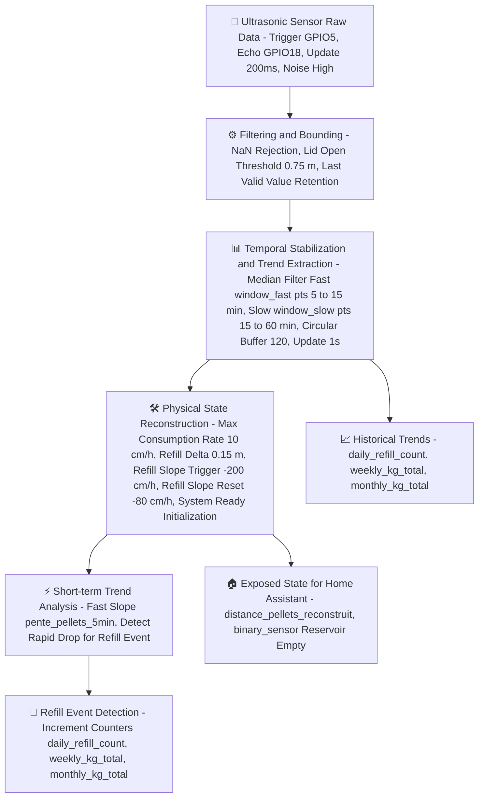

# pellets-level

The scope of this repo is to archive a method for pellets level measurement and statistical analysis based on a simple ultrasonic sensor :

### A/ Principles

1. **Measurement Acquisition**  
   A large volume of measurements is acquired in order to increase the signal-to-noise ratio through temporal redundancy.

2. **Filtering and Physical Bounding**  
   Filtering and bounding constraints are applied to enforce physical plausibility and to eliminate invalid or out-of-range measurements.

3. **Temporal Stabilization and Trend Extraction**  
   Temporal stability is established, and both short-term and long-term trends are derived from the filtered data.

4. **Physical State Reconstruction**  
   Physically consistent state variables are reconstructed based on the filtered measurements and the inferred temporal trends.

5. **Event Detection (Refill Identification)**  
   Abrupt variations are detected through short-term trend analysis in order to identify reservoir refill events.

### B/ ESP32 Pellets Signal Processing Pipeline



### C/ Results


### D/ Code

NB : sensor is based on esp-idf framework to allow usage of bluetooth proxy and 802.11k / 802.11v wifi mesh. adjust to your needs
  
```
# ==============================================================================
# CONFIGURATION GÉNÉRALE & SUBSTITUTIONS
# Ces variables définissent les constantes métier pour le calcul des stocks.
# On utilise une logique de "pente" pour différencier la consommation (lente) 
# du remplissage (rapide/brutal).
# ==============================================================================
substitutions:
  device_name: "niveau-pellets"
  friendly_name: "Niveau Pellets"
  
  pente_buffer_size: "120"         # Capacité du buffer (120 points x 30s = 60 min)
  slope_multiplier: "12000.0"      # Facteur de conversion mathématique : m/30s vers cm/h
  
  lid_open_threshold: "0.75"       # Seuil d'exclusion : au-delà de 75cm, le capot est jugé ouvert
  refill_delta_m: "0.15"           # Delta minimum (15cm) pour valider physiquement un sac
  refill_slope_trigger: "-200.0"   # Seuil de pente négative pour détection de remplissage
  refill_slope_reset: "-80.0"      # Hystérésis pour réarmer la détection de remplissage
  consumption_max_cm_h: "10.0"     # Bride de sécurité : consommation max théorique du poêle

# ==============================================================================
# PARAMÈTRES SYSTÈME & RÉSEAU
# Utilisation du framework ESP-IDF pour une meilleure stabilité des tâches BLE/WiFi.
# Le Bluetooth Proxy permet d'étendre la portée du Bluetooth via Home Assistant.
# ==============================================================================
esphome:
  name: "${device_name}"
  friendly_name: "${friendly_name}"
  min_version: 2025.1.0
  build_path: build/niveau-pellets
  includes:
    - theil_sen.h

esp32:
  board: esp32dev
  framework:
    type: esp-idf

esp32_ble:
  max_connections: 5

esp32_ble_tracker:
  scan_parameters:
    interval: 320ms
    window: 300ms
    active: true

bluetooth_proxy:
  active: true
  connection_slots: 5

logger:
  level: DEBUG
  baud_rate: 0

wifi:
  networks:
    - ssid: !secret wifi_ssid
      password: !secret wifi_password
    - ssid: !secret iot_ssid
      password: !secret iot_password
  manual_ip: 
    static_ip: 192.168.0.26
    gateway: 192.168.0.1
    subnet: 255.255.255.0
  power_save_mode: NONE
  enable_btm: true
  enable_rrm: true

api:
  encryption:
    key: !secret niveau_pellets_api_key

ota:
  - platform: esphome
    password: !secret niveau_pellets_admin

# ==============================================================================
# GESTION DU TEMPS & RÉINITIALISATION DES COMPTEURS
# Synchronisation NTP via Home Assistant pour gérer les cycles de consommation.
# Remise à zéro automatique des totaux (Journalier, Hebdomadaire, Mensuel).
# ==============================================================================
time:
  - platform: homeassistant
    timezone: "Europe/Paris"
    id: homeassistant_time
    on_time:
      - seconds: 0
        minutes: 0
        hours: 0
        then:
          - lambda: id(daily_refill_count) = 0;
      - seconds: 0
        minutes: 0
        hours: 0
        days_of_week: MON
        then:
          - lambda: id(weekly_kg_total) = 0;
      - seconds: 0
        minutes: 0
        hours: 0
        days_of_month: 1
        then:
          - lambda: id(monthly_kg_total) = 0;

# ==============================================================================
# RÉGLAGES DYNAMIQUES (Number)
# Permet l'ajustement en temps réel de la sensibilité de l'algorithme sans reflasher.
# - Fenêtres de pente : définit la robustesse face au bruit.
# - Seuil vide : définit l'alerte de niveau bas.
# ==============================================================================
number:
  - platform: template
    name: "Points pente Rapide"
    id: window_fast
    min_value: 3
    max_value: 30
    step: 1
    initial_value: 10
    unit_of_measurement: "pts"
    restore_value: yes
    optimistic: yes

  - platform: template
    name: "Points pente Lente"
    id: window_slow
    min_value: 15
    max_value: 120
    step: 1
    initial_value: 30
    unit_of_measurement: "pts"
    restore_value: yes
    optimistic: yes

  - platform: template
    name: "Seuil réservoir vide"
    id: empty_threshold
    min_value: 0.0
    max_value: 0.75
    step: 0.01
    initial_value: 0.30
    unit_of_measurement: "m"
    restore_value: yes
    optimistic: yes

# ==============================================================================
# VARIABLES GLOBALES
# Stockage en RAM (et Flash pour 'restore_value') des états persistants.
# Sert de mémoire tampon pour l'algorithme de reconstruction du niveau.
# ==============================================================================
globals:
  - id: last_valid_distance
    type: float
    restore_value: yes
    initial_value: '0.01'
  - id: last_reconstructed_level
    type: float
    restore_value: yes
    initial_value: '0.01'
  - id: system_ready
    type: bool
    initial_value: 'false'
  - id: pente_index
    type: int
    initial_value: '0'
  - id: pente_count
    type: int
    initial_value: '0'
  - id: daily_refill_count
    type: int
    restore_value: yes
    initial_value: '0'
  - id: weekly_kg_total
    type: int
    restore_value: yes
    initial_value: '0'
  - id: monthly_kg_total
    type: int
    restore_value: yes
    initial_value: '0'
  - id: refill_latch
    type: bool
    initial_value: 'false'

# ==============================================================================
# SECTION CAPTEURS
# ==============================================================================
sensor:
  - platform: wifi_signal
    name: "Qualité Signal WiFi"
    state_class: measurement
  - platform: internal_temperature
    name: "Température CPU ESP32"
    state_class: measurement

  # ----------------------------------------------------------------------------
  # STATISTIQUES DE CONSOMMATION
  # Conversion des variables globales en entités capteurs pour Home Assistant.
  # ----------------------------------------------------------------------------
  - platform: template
    name: "Rechargement Journalier"
    unit_of_measurement: "sacs"
    icon: "mdi:sack"
    state_class: measurement
    accuracy_decimals: 0
    lambda: return (float)id(daily_refill_count);

  - platform: template
    name: "Consommation Hebdomadaire"
    unit_of_measurement: "kg"
    icon: "mdi:weight-kilogram"
    state_class: measurement
    accuracy_decimals: 0
    lambda: return (float)id(weekly_kg_total);

  - platform: template
    name: "Consommation Mensuelle"
    unit_of_measurement: "kg"
    icon: "mdi:weight-kilogram"
    state_class: measurement
    accuracy_decimals: 0
    lambda: return (float)id(monthly_kg_total);

  # ----------------------------------------------------------------------------
  # 1. ACQUISITION BRUTE
  # Capteur HC-SR04. On utilise un filtre médian agressif pour éliminer les
  # échos parasites dus à la poussière ou aux parois du silo.
  # ----------------------------------------------------------------------------
  - platform: ultrasonic
    trigger_pin: GPIO5
    echo_pin: GPIO18
    name: "Distance pellets brute"
    id: distance_pellets_brute
    icon: "mdi:signal-distance-variant"
    update_interval: 200ms
    filters:
      - median:
          window_size: 41
          send_every: 5

  # ----------------------------------------------------------------------------
  # 2. BORNAGE ET GESTION DU CAPOT
  # Étape de "Sanity Check". Si la mesure dépasse le seuil physique (lid_open), 
  # on fige la valeur précédente pour éviter de fausser les calculs de pente 
  # pendant que l'utilisateur remplit le silo.
  # ----------------------------------------------------------------------------
  - platform: template
    name: "Distance pellets bornee"
    id: distance_pellets_bornee
    icon: "mdi:filter-check"
    unit_of_measurement: "m"
    accuracy_decimals: 3
    state_class: measurement
    update_interval: 1s
    lambda: |-
      float val = id(distance_pellets_brute)->state;
      float last = id(last_valid_distance);
      if (isnan(val)) return last;
      if (val > ${lid_open_threshold}) {
        return last;
      }
      if (val >= 0.01) {
        if (val < last || fabs(val - last) < 0.05) {
          id(last_valid_distance) = val;
          return val;
        }
      }
      return last;

  # ----------------------------------------------------------------------------
  # 3. BUFFERISATION CIRCULAIRE
  # Stockage des mesures dans un tableau (global_pente_buffer) pour permettre
  # l'analyse statistique sur le temps long. Un filtre médian temporel est 
  # appliqué pour lisser la courbe avant l'analyse de pente.
  # ----------------------------------------------------------------------------
  - platform: template
    name: "Distance pellets filtre median"
    id: distance_pellets_filtre_median
    icon: "mdi:filter-plus"
    unit_of_measurement: "m"
    accuracy_decimals: 3
    state_class: measurement
    update_interval: 1s
    lambda: return id(distance_pellets_bornee)->state;
    on_value:
      then:
        - lambda: |-
            if (!isnan(x)) {
              global_pente_buffer[id(pente_index)] = x;
              id(pente_index) = (id(pente_index) + 1) % ${pente_buffer_size};
              if (id(pente_count) < ${pente_buffer_size}) id(pente_count)++;
            }
    filters:
      - median:
          window_size: 300
          send_every: 30
      - lambda: |-
          return isnan(x) ? id(last_valid_distance) : x;

  # ----------------------------------------------------------------------------
  # 4 & 5. ESTIMATEUR DE PENTE (THEIL-SEN)
  # Utilisation de l'algorithme robuste de Theil-Sen pour calculer la tendance.
  # Contrairement à une régression linéaire classique, cet estimateur ignore
  # les valeurs aberrantes (outliers), idéal pour un milieu poussiéreux.
  # ----------------------------------------------------------------------------
  - platform: template
    name: "Pente pellets rapide"
    id: pente_pellets_5min
    icon: "mdi:trending-up"
    unit_of_measurement: "cm/h"
    accuracy_decimals: 2
    state_class: measurement
    update_interval: 30s
    lambda: |-
      int n = std::min(id(pente_count), (int)id(window_fast)->state);
      float s = compute_theil_sen_circular(n, id(pente_index), ${pente_buffer_size});
      float res = s * (float)${slope_multiplier};
      return (float)std::clamp(res, -5000.0f, 5000.0f);

  - platform: template
    name: "Pente pellets lente"
    id: pente_pellets_15min
    icon: "mdi:trending-up"
    unit_of_measurement: "cm/h"
    accuracy_decimals: 2
    state_class: measurement
    update_interval: 30s
    lambda: |-
      int n = std::min(id(pente_count), (int)id(window_slow)->state);
      float s = compute_theil_sen_circular(n, id(pente_index), ${pente_buffer_size});
      float res = s * (float)${slope_multiplier};
      return (float)std::clamp(res, -5000.0f, 5000.0f);

  # ----------------------------------------------------------------------------
  # 6. MOTEUR DE RECONSTRUCTION LOGIQUE
  # C'est ici que l'intelligence métier réside :
  # - Détecte un remplissage si la pente chute brutalement et le niveau monte.
  # - Verrouille (Latch) pour ne compter qu'un seul sac à la fois.
  # - Filtre la descente (consommation) en limitant la vitesse de variation
  #   physiquement possible du poêle pour ignorer les bruits de mesure.
  # ----------------------------------------------------------------------------
  - platform: template
    name: "Distance pellets reconstruit"
    id: distance_pellets_reconstruit
    icon: "mdi:ruler"
    unit_of_measurement: "m"
    accuracy_decimals: 3
    state_class: measurement
    update_interval: 30s
    lambda: |-
      float target = id(distance_pellets_filtre_median)->state;
      float current = id(last_reconstructed_level);
      float p_slow = isnan(id(pente_pellets_15min)->state) ? 0.0f : id(pente_pellets_15min)->state;
      float p_fast = isnan(id(pente_pellets_5min)->state) ? 0.0f : id(pente_pellets_5min)->state;

      if (!id(system_ready)) {
        if (!isnan(target)) {
          id(last_reconstructed_level) = target;
          id(system_ready) = true;
          ESP_LOGI("pellets", "System Ready. Level: %.3f m", target);
        }
        return id(last_reconstructed_level);
      }

      if (p_fast < (float)${refill_slope_trigger} && target < current - (float)${refill_delta_m}) {
        if (!id(refill_latch)) {
          id(daily_refill_count)++;
          id(weekly_kg_total) += 15;
          id(monthly_kg_total) += 15;
          id(refill_latch) = true;
          ESP_LOGI("pellets", "Sack added!");
        }
        id(last_reconstructed_level) = target;
      } 
      else {
        if (p_fast > (float)${refill_slope_reset}) id(refill_latch) = false;
        if (p_slow > 0) {
          float diff_m = target - current;
          if (diff_m > 0) {
            float limited_p = std::min(p_slow, (float)${consumption_max_cm_h}); 
            float max_step_m = limited_p / (float)${slope_multiplier};
            id(last_reconstructed_level) += std::min(diff_m, max_step_m);
          }
        }
      }
      return id(last_reconstructed_level);

# ==============================================================================
# CAPTEURS BINAIRES
# Alerte de niveau critique basée sur la distance reconstruite.
# Utilisation d'un 'delayed_on' pour éviter les fausses alertes passagères.
# ==============================================================================
binary_sensor:
  - platform: template
    name: "Réservoir Vide"
    device_class: problem
    lambda: return id(distance_pellets_reconstruit)->state > id(empty_threshold)->state;
    filters:
      - delayed_on: 30min

# ==============================================================================
# ACTIONS MANUELLES (Buttons)
# Permet de corriger manuellement les compteurs ou de redémarrer l'unité.
# Le forçage de remplissage recalibre immédiatement le niveau reconstruit.
# ==============================================================================
button:
  - platform: template
    name: "Forcer Remplissage (+15kg)"
    id: btn_force_refill
    icon: "mdi:sack-percent"
    on_press:
      - lambda: |-
          float current_level = id(distance_pellets_filtre_median).state;
          if (isnan(current_level)) {
            ESP_LOGW("manual_refill", "Capteur indisponible (NaN), action annulée.");
            return;
          }
          id(last_reconstructed_level) = current_level;
          id(daily_refill_count) += 1;
          id(weekly_kg_total) += 15;
          id(monthly_kg_total) += 15;
          id(refill_latch) = false;
          ESP_LOGI("manual_refill", "Remplissage forcé exécuté. Nouveau niveau : %.3f m", current_level);
          id(distance_pellets_reconstruit).update();

  - platform: restart
    name: "Redémarrer ESP32 Pellets"
    icon: "mdi:restart"

```
